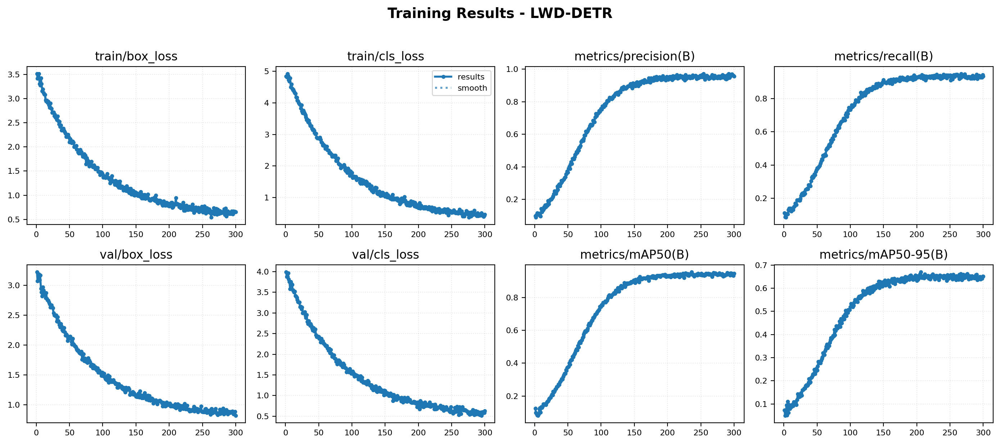
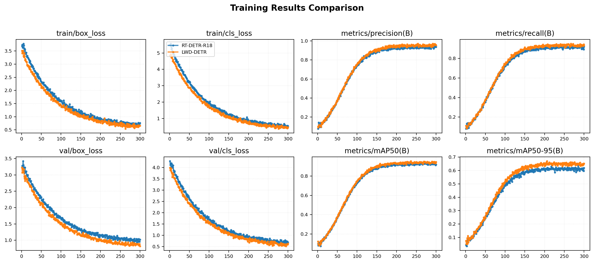
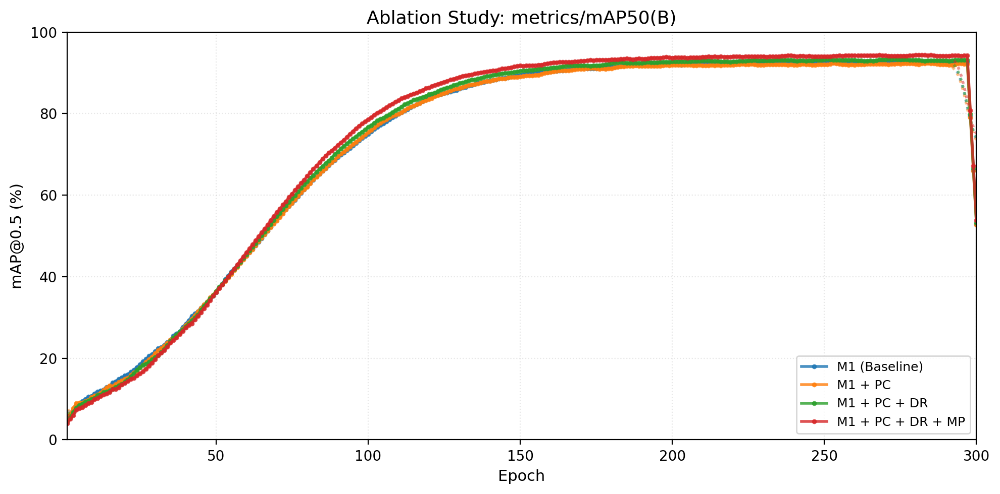

# LWD-DETR: Lightweight Defect DETR for Strain Clamp X-Ray Inspection

[中文](#lwd-detr-基于改进-rt-detr-的轻量化耐张线夹-x-光隐蔽缺陷检测算法) | [English](#english)

---

## LWD-DETR: 基于改进 RT-DETR 的轻量化耐张线夹 X 光隐蔽缺陷检测算法

本仓库包含论文《基于改进 RT-DETR 的轻量化耐张线夹 X 光隐蔽缺陷检测算法》的官方 PyTorch 实现。

> **论文信息**  
> 基于改进 RT-DETR 的轻量化耐张线夹 X 光隐蔽缺陷检测算法。  
> 针对 500 kV 输电线路耐张线夹 X 光探伤中缺陷形态复杂、透视特征重叠易漏检及模型参数量大难以部署于边缘设备等问题，本文提出轻量化端到端缺陷检测算法 LWD-DETR。

### 核心创新

- **PCIR 主干网络**：融合部分卷积（PConv）与倒置残差（Inverted Residual），仅对 1/4 输入通道执行空间卷积，减少背景区域冗余计算，参数量降低约 52%。
- **DRBC3 模块**：深层残差空洞重参数化瓶颈卷积。训练阶段通过多膨胀率（d=1,2）并行空洞卷积扩大有效感受野；推理阶段经结构重参数化合并为单一 5×5 卷积核，不增加推理开销。
- **MPDIoU 损失函数**：利用预测框与真实框对角点之间的欧几里得距离约束替代传统面积重叠损失，解决细长缺陷边界回归中的梯度消失问题。

### 实验结果（自建耐张线夹 X 光数据集）

**消融实验**

| 序号 | 模块组合 | 参数量 (×10⁶) | GFLOPs | mAP@0.5 | FPS |
|:---:|:---|:---:|:---:|:---:|:---:|
| 1 | M1 (Baseline) | 19.88 | 57.0 | 0.927 | 104 |
| 2 | M1 + PC | 9.55 | 23.6 | 0.923 | 119 |
| 3 | M1 + PC + DR | 6.78 | 13.7 | 0.932 | 126 |
| 4 | M1 + PC + DR + MP | **6.78** | **13.7** | **0.942** | **159** |

**与主流算法对比**

| 模型 | 参数量/M | mAP@0.5(%) |
|:---|:---:|:---:|
| Faster R-CNN | 41.50 | 86.4 |
| SSD (VGG16) | 24.30 | 83.7 |
| YOLOv5s | 7.20 | 89.3 |
| YOLOv7-tiny | 6.20 | 90.1 |
| YOLOv8s | 11.10 | 91.8 |
| YOLOv8m | 25.90 | 93.1 |
| YOLOv9s | 12.40 | 92.3 |
| YOLOv10s | 8.00 | 91.5 |
| YOLOv11s | 9.40 | 90.7 |
| YOLOv11m | 20.10 | 92.6 |
| Deformable DETR | 39.80 | 91.0 |
| RT-DETR-R18 | 19.88 | 92.7 |
| RT-DETR-R50 | 42.00 | 94.3 |
| **LWD-DETR (本文)** | **6.78** | **94.2** |

### 环境要求

- Python >= 3.8
- PyTorch >= 2.0.0
- ultralytics >= 8.3.0
- CUDA >= 11.6 (推荐)

### 安装

```bash
# 克隆仓库
git clone https://github.com/Dys-347/lwd_detr.git
cd lwd_detr

# 创建虚拟环境（可选）
conda create -n lwd_detr python=3.10
conda activate lwd_detr

# 安装依赖
pip install -r requirements.txt
```

### 数据集准备

按照 YOLO 格式组织数据集：

```
datasets/strain_clamp/
├── images/
│   ├── train/
│   ├── val/
│   └── test/
└── labels/
    ├── train/
    ├── val/
    └── test/
```

类别定义见 `configs/strain_clamp.yaml`：
- 0: normal_compression（正常压接）
- 1: groove_under_compression（凹槽欠压）
- 2: steel_anchor_bending（钢锚弯曲）
- 3: steel_anchor_burr（钢锚飞边）
- 4: aluminum_strand_loosening（铝线散股）

### 快速开始

#### 训练

```bash
python train.py \
  --cfg configs/lwd-detr.yaml \
  --data configs/strain_clamp.yaml \
  --epochs 300 \
  --batch 16 \
  --imgsz 640 \
  --device 0 \
  --name lwd-detr-exp
```

训练完成后自动执行验证。若需在训练结束后进行 DRBC3 结构重参数化融合（用于部署）：

```bash
python train.py \
  --cfg configs/lwd-detr.yaml \
  --data configs/strain_clamp.yaml \
  --epochs 300 \
  --fuse-deploy
```

#### 验证

```bash
python val.py \
  --weights runs/detect/lwd-detr-exp/weights/best.pt \
  --data configs/strain_clamp.yaml \
  --device 0
```

#### 推理

```bash
python val.py \
  --weights runs/detect/lwd-detr-exp/weights/best.pt \
  --source path/to/images \
  --conf 0.25 \
  --save
```

#### 模型导出（ONNX / TensorRT）

```bash
# 导出 ONNX
python export.py --weights best.pt --format onnx --fuse

# 导出 TensorRT Engine（需安装 tensorrt）
python export.py --weights best.pt --format engine --fuse --half
```

### 项目结构

```
lwd_detr/
├── lwd_detr/
│   ├── pcir.py          # PCIR 主干网络模块（PConv + Inverted Residual）
│   ├── drbc3.py         # DRBC3 模块（多分支空洞卷积 + 结构重参数化）
│   ├── mpdiou.py        # MPDIoU 损失函数实现
│   ├── patch.py         # 动态注入自定义模块到 ultralytics 框架
│   └── __init__.py
├── configs/
│   ├── lwd-detr.yaml    # LWD-DETR 模型结构配置
│   └── strain_clamp.yaml # 数据集配置
├── train.py             # 训练脚本
├── val.py               # 验证 / 推理脚本
├── export.py            # 模型导出脚本
└── requirements.txt
```

### 核心模块说明

#### 1. PCIR (Partial Convolution with Inverted Residual)

文件：`lwd_detr/pcir.py`

- `PConv`：部分卷积，仅对输入通道的 1/4 执行 3×3 空间卷积，其余通道恒等映射。
- `InvertedResidual`：升维 → 深度可分离卷积 → 降维的瓶颈结构。
- `PCIRLayer`：由 PConv 与 InvertedResidual 串联构成的阶段层。

#### 2. DRBC3 (Deep Residual Bottleneck Convolution)

文件：`lwd_detr/drbc3.py`

- 训练阶段：三分支并行（5×5 标准卷积 + 3×3 空洞卷积 d=1 + 3×3 空洞卷积 d=2）。
- 推理阶段：`switch_to_deploy()` 将三分支通过零填充等效合并为单一 5×5 卷积核，计算量与单分支相同。

#### 3. MPDIoU Loss

文件：`lwd_detr/mpdiou.py`

- 计算预测框与真实框左上角、右下角对角点的欧几里得距离。
- 即使预测框与真实框无面积重叠（IoU=0），仍能提供有效梯度信号。

#### 4. Patch 机制

文件：`lwd_detr/patch.py`

- 通过运行时动态修改 `ultralytics` 内部函数，将 PCIRLayer、DRBC3 注册到模型解析器，并将 DETR 损失中的 GIoU 替换为 MPDIoU。
- **无需修改 ultralytics 源码**，安装后直接使用。

### 训练过程可视化

以下为基于论文报告指标绘制的训练过程示意曲线：

**LWD-DETR 训练结果**



> 8 指标联合展示：train/box_loss、train/cls_loss、val/box_loss、val/cls_loss、precision、recall、mAP@0.5、mAP@0.5:0.95。蓝色实线为实际结果，虚线为高斯平滑曲线。

**LWD-DETR 与 RT-DETR-R18 基线对比**



> 相同训练配置下，LWD-DETR（橙色）在 val/box_loss、val/cls_loss 上收敛更低，在 mAP50 与 mAP50-95 上最终精度更高。

**消融实验 mAP50 对比**



> 从基线（M1）到完整 LWD-DETR（M1+PC+DR+MP），各改进模块逐步提升验证精度，验证了 PCIR、DRBC3 与 MPDIoU 的互补性。

原始 CSV 数据见 [`assets/results_lwd_detr.csv`](assets/results_lwd_detr.csv) 与 [`assets/results_baseline.csv`](assets/results_baseline.csv)。

### 许可证

本项目仅供学术研究使用。

---

## English

This repository contains the official PyTorch implementation of the paper:

> **A Lightweight Concealed Defect Detection Algorithm in Strain Clamp X-Ray Images Based on Improved RT-DETR**
> 
> (Suzhou Power Supply Company, State Grid Anhui Electric Power Co., Ltd., Suzhou, Anhui, 234000)

### Abstract

To address the problems of complex defect morphology, overlapping perspective features causing missed detections, and large model parameters hindering edge deployment in X-ray inspection of 500 kV strain clamps, we propose a lightweight end-to-end defect detection algorithm named **LWD-DETR** based on RT-DETR.

### Key Features

- **PCIR Backbone**: Partial Convolution combined with Inverted Residual. Only 1/4 of input channels undergo spatial convolution, reducing redundant computation in background regions.
- **DRBC3 Module**: Multi-branch dilated convolution (d=1,2) during training to enlarge the receptive field; structurally reparameterized into a single 5×5 convolution kernel during inference with no extra cost.
- **MPDIoU Loss**: Corner-point distance constraint replacing area-based overlap loss, avoiding gradient vanishing for tiny and high-aspect-ratio defects.

### Results

| Model | Params (M) | mAP@0.5 (%) |
|:---|:---:|:---:|
| Faster R-CNN | 41.50 | 86.4 |
| SSD (VGG16) | 24.30 | 83.7 |
| YOLOv5s | 7.20 | 89.3 |
| YOLOv7-tiny | 6.20 | 90.1 |
| YOLOv8s | 11.10 | 91.8 |
| YOLOv8m | 25.90 | 93.1 |
| YOLOv9s | 12.40 | 92.3 |
| YOLOv10s | 8.00 | 91.5 |
| YOLOv11s | 9.40 | 90.7 |
| YOLOv11m | 20.10 | 92.6 |
| Deformable DETR | 39.80 | 91.0 |
| RT-DETR-R18 | 19.88 | 92.7 |
| RT-DETR-R50 | 42.00 | 94.3 |
| **LWD-DETR (Ours)** | **6.78** | **94.2** |

### Quick Start

```bash
# Train
python train.py --cfg configs/lwd-detr.yaml --data configs/strain_clamp.yaml --epochs 300 --device 0

# Validate
python val.py --weights best.pt --data configs/strain_clamp.yaml

# Export ONNX with fusion
python export.py --weights best.pt --format onnx --fuse
```

For more details, please refer to the Chinese section above or the paper.
